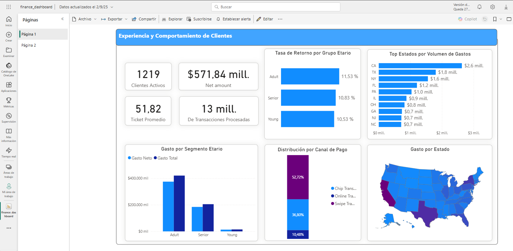
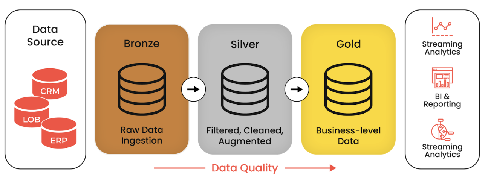
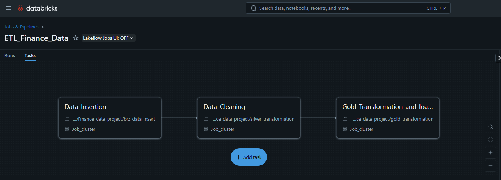

# Dashboard de Análisis de Transacciones y NPS (Databricks + Power BI)

## Tabla de Contenidos

- [Resumen](#resumen)
- [Descripción del Dataset](#descripción-del-dataset)
- [Tecnologías](#tecnologías)
- [Vistas del Dashboard](#vistas-del-dashboard)
- [Modelado de Datos](#modelado-de-datos)
- [Indicadores](#indicadores)
- [Disclaimer](#disclaimer)
- [Autor](#autor)

---

## Resumen

Este proyecto implementa un **pipeline analítico completo** para transacciones bancarias utilizando la **Arquitectura Medallion (Bronze → Silver → Gold)** en **Databricks con PySpark**, con visualización en **Power BI**.  

Los objetivos son:
- Limpiar y estandarizar datos de transacciones, usuarios y tarjetas (capas Bronze/Silver).  
- Construir una **capa Gold** con KPIs a nivel cliente (fraude, presión crediticia, gasto neto).  
- Entregar **insights comerciales** (hábitos de gasto, segmentos de edad, canales, geografía).  
- Entregar **insights de riesgo** (exposición a fraude, ratio de deuda, score crediticio).  
- Diseñar un dashboard interactivo con dos vistas principales:
  - **Experiencia y Comportamiento Comercial de Clientes**  
  - **Riesgo Financiero y Exposición a Fraude** (En Desarrollo)

🔗 **Dataset Source:**  
[Kaggle – Transactions & Fraud Dataset](https://www.kaggle.com/datasets/computingvictor/transactions-fraud-datasets?select=cards_data.csv)  

🔗 **Dashboard Interactivo (Power BI Service):**  
[▶️ Ver Dashboard](https://app.powerbi.com/view?r=eyJrIjoiNDU4NWYyYTYtNDkyMC00YjlkLWIyNDQtYThjYzljMTQ0NjVhIiwidCI6IjdmMDBjMGNjLTE3NzgtNDBlOS1iMTAzLWU2N2Q1MGE0NWMwZSJ9)

---

## Descripción del Dataset

| Tabla               | Descripción                                                                  |
|---------------------|------------------------------------------------------------------------------|
| `transactions_data` | +12M de transacciones con tarjetas: monto, canal, comercio, ubicación, errores |
| `cards_data`        | Información de tarjetas: marca, tipo, fecha de emisión, límite, chip, dark web |
| `users_data`        | Información de clientes: demografía, ingresos, deudas, score crediticio, geo |

Tras la limpieza en Silver, todos los campos fueron normalizados (fechas, numéricos, categorías) y preparados para la agregación.

---

## Tecnologías

- **Databricks (PySpark + Delta Lake)** – Pipeline ETL/ELT con arquitectura Medallion  
- **AWS S3** – Almacenamiento de las capas Bronze, Silver y Gold  
- **Power BI Desktop** – Diseño de dashboard y lógica DAX  
- **GitHub** – Control de versiones y documentación  

---

## Vistas del Dashboard

### Página 1 – Experiencia y Comportamiento Comercial de Clientes

Incluye:
- KPIs: clientes activos, transacciones procesadas, gasto bruto vs. neto, ticket promedio.  
- Ratio de devoluciones por grupo etario (proxy de experiencia del cliente).  
- Gasto por segmento de edad.  
- Distribución de canales (chip, swipe, online).  
- Análisis geográfico (mapa + top estados por volumen).  

---

### Página 2 – Riesgo Financiero y Exposición a Fraude

Incluye:
- KPIs: % de clientes en riesgo de fraude (`fraude_flag`), % de tarjetas en dark web, ratio de deuda, utilización de crédito.  
- Dispersión: ingresos anuales vs. deuda total, coloreado por banda de score crediticio.  
- Gasto promedio por segmento de score.  
- Segmentación de fraude (alto gasto online + exposición dark web).  
- Tabla de detalle de clientes en riesgo.  

---

## Modelado de Datos

El pipeline sigue la **Arquitectura Medallion**:

- **Bronze** → ingestión cruda desde CSVs de Kaggle.  
- **Silver** → limpieza (tipos, duplicados, outliers, negativos como devoluciones).  
- **Gold** → indicadores a nivel cliente (`clients_gold`), agregación por comercio (`merchants_gold`) y por estado (`geo_gold`).  

Power BI se conecta directamente a las tablas Gold usando Databricks SQL Warehouse.  

---

## Disclaimer

Todos los datos han sido **anonimizados** y son de acceso público a través de Kaggle.  
Este proyecto se ha desarrollado únicamente con fines **educativos y de portafolio profesional**.  
No representa información real de clientes ni de instituciones financieras.  

---

## Autor

**Renzo Gabriel Sánchez Quispe**  
📍 Lima, Perú  
📫 renzosanchez201@gmail.com  
🔗 [GitHub Profile](https://github.com/renzosan25)

---
